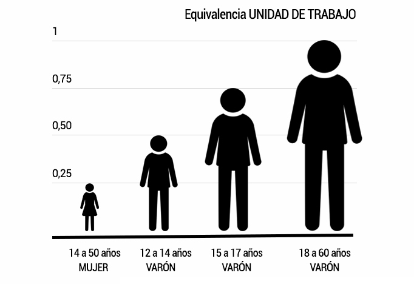

Aunque puede parecer que las políticas de colonización se construyen de espaldas al género, es el trabajo reproductivo y de cuidados el que convierte en viable al proyecto en si. Las mujeres han aparecido en el diseño del proyecto colonizador, cuando lo han hecho, como apéndices complementarios de aquel varón vinculado al mundo agrícola que asumía todo el protagonismo, a la vez que se utilizaba y se reconstruía como símbolo patrio. Ellas están y participan en todas y cada una de las etapas del proceso.

Algunas se vinculan al hecho colonizador como **familiares de los presos políticos** que adscritos al [Programa de Redención de Penas por el Trabajo](https://medialab-prado.github.io/poblados-colonizacion-colonias-penitenciarias/presos.html#redencion-penas) construyen las numerosas infraestructuras que vertebrarán los nuevos espacios de regadío.
>El ingreso en la cárcel y, posteriormente, en el campo de trabajo significaba un duro golpe para la subsistencia de todo el grupo familiar. A partir de ese momento las mujeres debían asumir un nuevo papel: ellas pasaban a ser las "cabezas" de familia. Era necesario subsistir fuera del campo, y en ocasiones era necesario buscar dinero para aproximarse a Sevilla para estar cerca de los compañeros apresados y poder llevarles comida. A la vez, muchas de estas mujeres se hicieron cargo de la manutención de los padres ancianos impedidos para el trabajo remunerado. Las vidas de las mujeres de los presos se asemejan en muchas cosas unas
a otras. Son vidas paralelas donde la autoexplotación de todo el grupo doméstico es imprescindible para la supervivencia. -[El canal de los presos, 1940-1962](https://www.planetadelibros.com/libro-el-canal-de-los-presos-1940-1962/17486#soporte/17486)

En relación a las mujeres que trabajan en labores agrícolas encontramos a mujeres, que gozando del estátus que suponía ser **esposa o hija de colono**, por necesidad económica o doméstica asumían como temporeras labores en las fincas cercanas o en la propia parcela familiar. Y fue el trabajo de ellas el que se cuantificó mediante un sistema de equivalencia que se ponía en relación con los [requisitos para ser seleccionado como colono](https://medialab-prado.github.io/poblados-colonizacion-colonias-penitenciarias/colono.html) Este sistema invisibilizaba a las mujeres de la unidad familiar cuando no las ubicaba en los tramos más bajos en relación con el trabajo productivo. Así, las mujeres dedicadas a los trabajos domésticos (esposa del colono) y las que, en el núcleo familiar tuvieran a su cargo hijos/as menores de tres años no computaban de ningún modo como fuerza laboral. Además, las que sí que lo hacían por no ubicarse en los epígrafes anteriormente mencionados, tan sólo obtenían un 0,25, la mitad de lo que representaba un varón de entre 12 y 14 años (0,50).

Fuente: Elaboración propia a partir de GÓMEZ BENITO, C. Políticos, burócratas y expertos. Un estudio de la política agraria y la sociología rural en España (1936-1959). Siglo XXI de España Editores S.A (1995) e iconos de Adrien Coquet en [Noun Project](http://thenounproject.com)
laséstas las que fueron cuantificadas

Por otro, lado lo que denominaríamos 

En el caso de las **jornaleras** nos encontramos,
doméstica en labores ,

>“¿y cien kilos de algodón una mujer? Recoger 100 kilos de algodón en una jornada ya era recoger algodón, más que los hombres. Se pagaba por kilo. Nos poníamos mi hermano y yo y como mucho cogíamos 30 kilos, te desriñonabas de intentarlo. Eran sobre todo jornaleras.” -Milagros, hija de colono.

cNo solo ha sido invisibilizado el trabajo reprodictivo y de cuidados
**¿Quiénes son?** 

El sistema de equivalencia que se estableció como uno de los [requisitos para ser seleccionado como colono](https://medialab-prado.github.io/poblados-colonizacion-colonias-penitenciarias/colono.html) invisibilizaba a las mujeres de la unidad familiar cuando no las ubicaba en los tramos más bajos en relación con el trabajo productivo. Así, las mujeres dedicadas a los trabajos domésticos (esposa del colono) y las que, en el núcleo familiar tuvieran a su cargo hijos/as menores de tres años no computaban de ningún modo como fuerza laboral. Además, las que sí que lo hacían por no ubicarse en los epígrafes anteriormente mencionados, tan sólo obtenían un 0,25, la mitad de lo que representaba un varón de entre 12 y 14 años (0,50).

Fuente: Elaboración propia a partir de GÓMEZ BENITO, C. Políticos, burócratas y expertos. Un estudio de la política agraria y la sociología rural en España (1936-1959). Siglo XXI de España Editores S.A (1995) e iconos de Adrien Coquet en [Noun Project](http://thenounproject.com)

Maestras solas (solteras, viudas, separadas); 

esposas-hijas de los colonos, El Hogar, la sección femenina. 

Las "maestras", las únicas remuneradas. 
  

